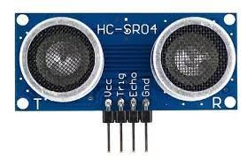

----


# Carro Seguidor de Linha


 SISTEMAS EMBARCADOS
 
 4° Semestre - FATEC Jundiaí
 
 Integrantes:
 - Alessandro Vinicius da Silva e Lima;
 - Márcio Batista da Fonseca;
 - Misael Fernandes Soares;
 - Rafael Massayoshi Hamazaki;
 - Túlio Moreira Costa ;
 
 ----
# Sumário:

1 - Introdução;

2 - Materiais;

3 - Código-Fonte;

4 - Conclusão do Projeto;

5 - Link do vídeo;

----
 # 1 - Introdução
 
 Com o advento da Industria 4.0 ou Quarta Revolução Industrial, que engloba as tecnologias de Inteligência Artificial, Internet das Coisas, Computação em Nuvem, Big Data entre outras. A partir da integração entre os sistemas (Computação, Mecânica, Eletrônica), deriva-se a robótica e a automação, que são técnicas destinadas a automatizar os processos industriais, substituindo o trabalho físico e mental do homem por equipamentos.
 
As tecnologias de Inteligência Artificial, Internet das Coisas, Computação em Nuvem, Big Data, e a integração com a robótica e automação com objetivo de promover a otimização dos processos industriais, com o consequente aumento da produtividade e lucratividade.

Pensando nesses fatores, foi agregada no curso de Sistemas Embarcados a construção de um sistema produtivo logístico, iniciada com a primeira turma de Sistemas Embarcados, com a construção de uma esteira para separação de itens aprovados e reprovados. As peças reprovadas são direcionadas a um determinado recipiente, sendo que as peças aprovadas são içadas por um braço robótico, elaborado pela segunda turma de Sistemas Embarcados, e colocados em um veículo seguidor de linha que encaminha essas peças para armazenamento.

 ----
 # 2 - Materiais
 
 Para a montagem do Veículo Seguidor de Linha, foram adquiridos separadamente um Microcontrolador ESP32, Drive de Motor Ponte H com Microcontrolador L298n, Modulo Seguidor de Linha Infravermelho 4 Canais e uma Bateria 9,V recarregável que serão conectadosa um Chassi Acrílico composto com Motor DC, rodas de borracha e roda boba.

+ ESP 32


+ Ponte H


+ Modulo Seguidor de Linha


+ Bateria Recarregavel


+ Chassi Acrilico


+ Sensor Ultrassonico



----

# 3 - Código-Fonte

```

import machine
import time


# Define pinos para as saídas dos motores

in1 = machine.PWM(machine.Pin(27), freq=1000, duty=0)   #Frente motor esquerdo
in2_pin = 26
in3_pin = 25
in4 = machine.PWM(machine.Pin(33), freq=1000, duty=0)   #Fente motor direito

# Initializa pinos GPIO para os motores e sensor de peça

in2 = machine.Pin(in2_pin, machine.Pin.OUT)
in3 = machine.Pin(in3_pin, machine.Pin.OUT)

trigger_pin = machine.Pin(13, machine.Pin.OUT)
echo_pin = machine.Pin(12, machine.Pin.IN)


#Define as velocidades dos motores (de 0 a 1023).

curva = 550
curva1 = 850
reto = 900


# Funções de direção dos motores
def frente():
    print("frente")
    in1.freq(1000)
    in1.duty(reto)
    in2.value(0)
    in3.value(0)
    in4.freq(1000)
    in4.duty(reto)

def esquerda():
    print("esquerda")
    in1.freq(1000)
    in1.duty(curva)
    in2.value(0)
    in3.value(0)
    in4.freq(1000)
    in4.duty(curva1)
    
def esquerda_fechada():
    print("esquerda_fechada")
    in1.freq(1000)
    in1.duty(0)
    in2.value(0)
    in3.value(0)
    in4.freq(1000)
    in4.duty(curva)
    
def direita():
    print("direita")
    in1.freq(1000)
    in1.duty(curva1)
    in2.value(0)
    in3.value(0)
    in4.freq(1000)
    in4.duty(curva)
    
def direita_fechada():
    print("direita_fechada")
    in1.freq(1000)
    in1.duty(curva)
    in2.value(0)
    in3.value(0)
    in4.freq(1000)
    in4.duty(0)
    
def parada():
    print("parada")
    in1.freq(1000)
    in1.duty(0)
    in2.value(0)
    in3.value(0)
    in4.freq(1000)
    in4.duty(0)
    
    trigger_pin.on()
    time.sleep_us(10)
    trigger_pin.off()
        
    pulse_duration = machine.time_pulse_us(echo_pin, 1, 30000)
    distancia = int(pulse_duration / 58.0)
    
    estado_anterior = distancia
    while True:
        trigger_pin.on()
        time.sleep_us(10)
        trigger_pin.off()
        
        pulse_duration = machine.time_pulse_us(echo_pin, 1, 30000)
        distancia = int(pulse_duration / 58.0)
    
        estado_atual = distancia
        print(distancia)
        if estado_atual != estado_anterior and estado_anterior != estado_atual+1 and estado_anterior != estado_atual-1:
            time.sleep(1)
            in1.freq(1000)
            in1.duty(500)
            in2.value(0)
            in3.value(0)
            in4.freq(1000)
            in4.duty(500)
            time.sleep(0.5)
            break
        estado_anterior = estado_atual
        
        time.sleep(0.1)
    
    while True:
        if valor_sensor_parada.read() < 1000:
            break
            
#     sensor_carga = machine.Pin(3, Pin.IN)
#     presenca_carga = sensor_carga.value()
#     while True:
#         carga_anterior = presenca_carga
#         time.sleep(0.1) 
#         presenca_carga = carga.value()
#         if carga_anterior != presenca_carga:
#             break
        
    
#     carga_anterior = presenca_carga

# loop de controle do robo
while True:
    # Lê sensores infra-vermelho e chama a função de direção apropriada.
    
    valor_sensor_esquerdo = machine.ADC(machine.Pin(34))
    valor_sensor_direito = machine.ADC(machine.Pin(35))
    valor_sensor_meio = machine.ADC(machine.Pin(32))
    valor_sensor_parada = machine.ADC(machine.Pin(14))
   
   
   
    print ("e", valor_sensor_esquerdo.read()/4, "    ", valor_sensor_direito.read()/4, "    ", valor_sensor_meio.read()/4)
     
     
    
    if valor_sensor_parada.read() > 1000:
        parada()
    if valor_sensor_esquerdo.read() < 1000 and valor_sensor_direito.read() > 1000 and valor_sensor_meio.read() < 1000:
        direita_fechada()
    elif valor_sensor_esquerdo.read() < 1000 and valor_sensor_direito.read() > 1000 and valor_sensor_meio.read() > 1000:
        direita()
    elif valor_sensor_esquerdo.read() > 1000 and valor_sensor_direito.read() > 1000 and valor_sensor_meio.read() > 1000:
        frente()
    elif valor_sensor_esquerdo.read() > 1000 and valor_sensor_direito.read() < 1000 and valor_sensor_meio.read() < 1000:
        esquerda_fechada()
    elif valor_sensor_esquerdo.read() > 1000 and valor_sensor_direito.read() < 1000 and valor_sensor_meio.read() > 1000:
        esquerda()
    elif valor_sensor_esquerdo.read() < 1000 and valor_sensor_direito.read() < 1000 and valor_sensor_meio.read() > 1000:
        frente()
    else:
        in1.freq(1000)
        in1.duty(0)
        in4.freq(1000)
        in4.duty(0)

    
    time.sleep(0.1) 
    
    
```
    
   ---- 
    
    
   # Conclusão do Projeto
   
   
   Com o encerramento das tarefas criadas durante todo o processo de planejamento e execução do projeto integrador III – Veículo Guiado (AGV), respeitando e validando todo o fluxo do processo determinado, é possível avaliar em conjunto que o que temos como resultado se aproxima muito do que foi proposto no kick-off do projeto, existem sim algumas variáveis que por alguma razão não entendemos ser importante controlar no início (como os elementos de fixação dos sensores) e que de certa forma provocou alguns impactos em nosso tempo de realização assim como no resultado, mas com as ferramentas utilizadas, o apoio dos professores e a boa relação do grupo foi possível realizar a entrega, com qualidade.
   
Com foco especifico na execução do projeto, é possível analisar que do planejamento a execução é de extrema importância, o domínio sobre os ajustes mecânicos e toda a sua montagem, a complexidade de integrar os elementos em um escopo que permita extrair o máximo de qualidade e funcionamento de todos os elementos envolvidos nos faz pensar que o uso de uma ferramenta de CAD, com desenho assistido por computador seja um conhecimento que mitiga os riscos de execução no rascunho do projeto de desenho analisando com foco na realização, a funcionalidade do projeto do braço robótico integra de maneira satisfatória com o sistemas de transferências de cargas com o “Veiculo Guiado” (AVG), e que para nós elementos do grupo foi uma grande experiência poder realizar esse trabalho, em todos os aspectos, programação, processo de compras, montagem e as discussões do grupo, amadurecendo nosso relacionamento interpessoal e nossa comunicação profissional.

