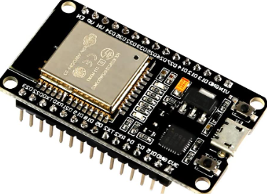
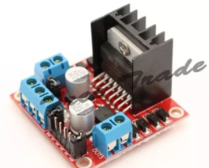
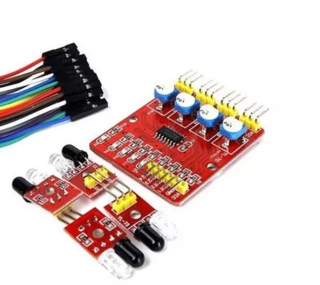
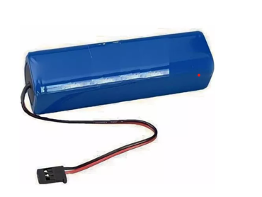
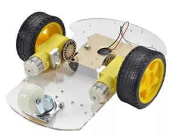

----

# Carro Seguidor de Linha

 SISTEMAS EMBARCADOS
 
 4° Semestre - FATEC Jundiaí
 
 Integrantes:
 - Alessandro Vinicius da Silva e Lima;
 - Márcio Batista da Fonseca;
 - Misael Fernandes Soares;
 - Rafael Massayoshi Hamazaki;
 - Túlio Moreira Costa ;
 
 ----
# Sumário:

1 - Introdução;

2 - Materiais;

3 - Código-Fonte;

4 - Conclusão do Projeto;

5 - Link do vídeo;

----
 # 1 - Introdução
 
 Com o advento da Industria 4.0 ou Quarta Revolução Industrial, que engloba as tecnologias de Inteligência Artificial, Internet das Coisas, Computação em Nuvem, Big Data entre outras. A partir da integração entre os sistemas (Computação, Mecânica, Eletrônica), deriva-se a robótica e a automação, que são técnicas destinadas a automatizar os processos industriais, substituindo o trabalho físico e mental do homem por equipamentos.
 
As tecnologias de Inteligência Artificial, Internet das Coisas, Computação em Nuvem, Big Data, e a integração com a robótica e automação com objetivo de promover a otimização dos processos industriais, com o consequente aumento da produtividade e lucratividade.

Pensando nesses fatores, foi agregada no curso de Sistemas Embarcados a construção de um sistema produtivo logístico, iniciada com a primeira turma de Sistemas Embarcados, com a construção de uma esteira para separação de itens aprovados e reprovados. As peças reprovadas são direcionadas a um determinado recipiente, sendo que as peças aprovadas são içadas por um braço robótico, elaborado pela segunda turma de Sistemas Embarcados, e colocados em um veículo seguidor de linha que encaminha essas peças para armazenamento.

 ----
 # 2 - Materiais
 
 Para a montagem do Veículo Seguidor de Linha, foram adquiridos separadamente um Microcontrolador ESP32, Drive de Motor Ponte H com Microcontrolador L298n, Modulo Seguidor de Linha Infravermelho 4 Canais e uma Bateria 9,V recarregável que serão conectadosa um Chassi Acrílico composto com Motor DC, rodas de borracha e roda boba.

+ ESP 32

+ Ponte H

+ Modulo Seguidor de Linha

+ Bateria Recarregavel

+ Chassi Acrilico

----

# 3 - Código-Fonte

----

# 4 - Conclusão do Projeto

